# Architecture: 
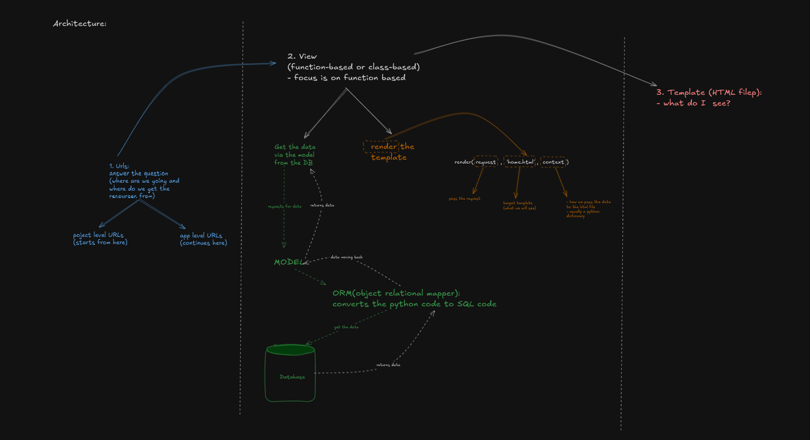

To setup your project kindly reference to this[repository.](https://github.com/JosephRidge/django-study-jam/tree/main)


## **Objectives:**
- [ ] Create the **admin super user** 
- [ ] Create models 
- [ ] **Register** models to the admin panel
- [ ] **Create the tables in the DB(SQLite3)**
- [ ] Perform **CRUD** operations via the admin panel
- [ ] Perform **CRUD** operations via the view...model..template
    - [ ] Create the Model Form 
    - [ ] Create `form.html` and pass in he ``
    - [ ] Create the **Create** url and view function
    - [ ] Create the **Read One** url and view function
    - [ ] Create the **Read All** url and view function
    - [ ] Create the **Update** url and view function
    - [ ] Create the **Delete** url and view function

[Read this before proceeding](https://docs.google.com/document/d/1M9-WpZwoViauO0GI2hpoW8lPg4RBLnpwjaro9AdWgxk/edit?usp=sharing)


### Run migrate on terminal to crate the auth tables:
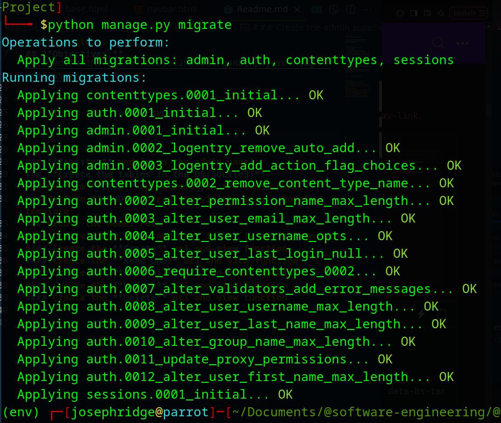


### Create the **admin super user** 
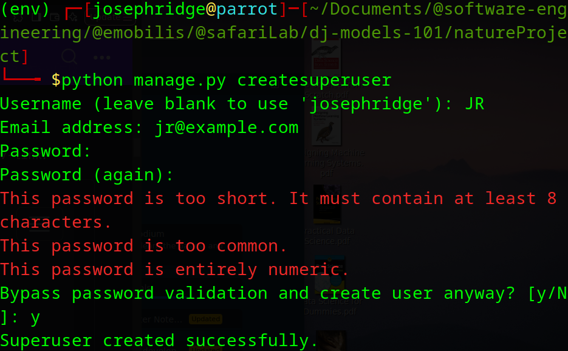

### Create models 
Kinldy note that we willbe dealing with s relational DB, in this case SQLite3. When it comes to relational DBs we have tables, inside those tables we have rows and columns now the columns a features that have their own data types based on their needs. 

In Django, models give us access to the respective data types, let us create two models. 

```
class Lake(models.Model):
    name = models.CharField(max_length=150)
    description = models.TextField()
    size = models.FloatField()
    latitude=models.FloatField()
    longitude =models.FloatField()
    isSalty = models.BooleanField(default=False)
    updated_at = models.DateTimeField(auto_now=True)
    created_at = models.DateTimeField(auto_now_add=True)

    def __str__(self):
        return self.name

    
class Ocean(models.Model):
    name = models.CharField(max_length=150)
    description = models.TextField()
    size = models.FloatField()
    latitude=models.FloatField()
    longitude =models.FloatField()
    isSalty = models.BooleanField(default=False)
    updated_at = models.DateTimeField(auto_now=True)
    created_at = models.DateTimeField(auto_now_add=True)

    def __str__(self):
        return self.name

```

### **Register** models to the admin panel in the app-level`admin.py`
```
    from django.contrib import admin
    from .models import Lake, Ocean

    # Register your models here.
    admin.site.register(Lake)
    admin.site.register(Ocean)
```

### **Create the tables in the DB(SQLite3)**
`makemigrations`: create the schema of the DB and migrate creates the tables in theDB. Hence run this:
- `python manage.py makemigrations`
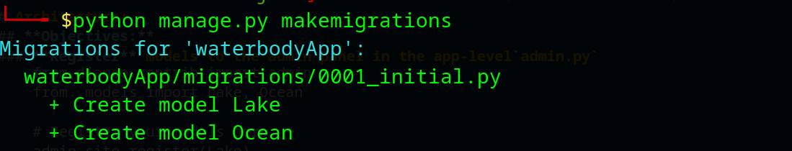

- `python manage.py migrate`
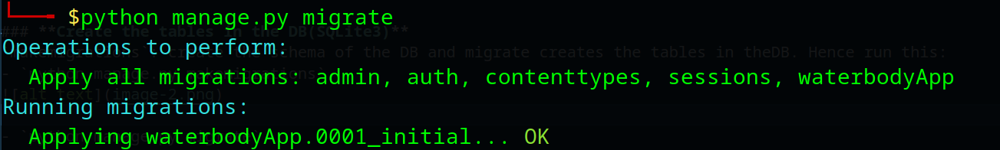

### Perform **CRUD** operations via the admin panel
Run your application now: `python manage.py runserver`. You will no longer see unapploed migrations error: 
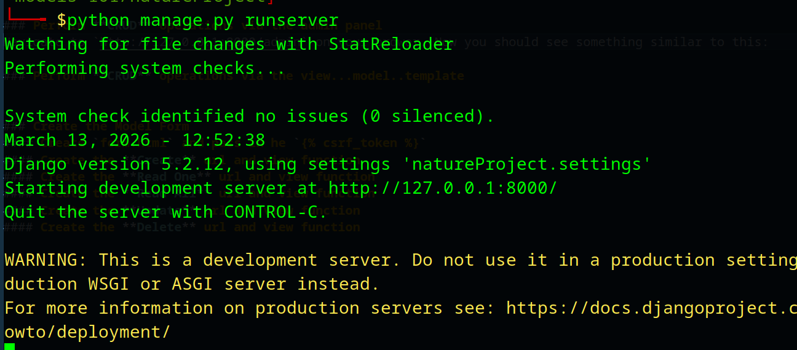

Navigate to `http://127.0.0.1:8000/admin` on your brower. Now you should see something similar to this:
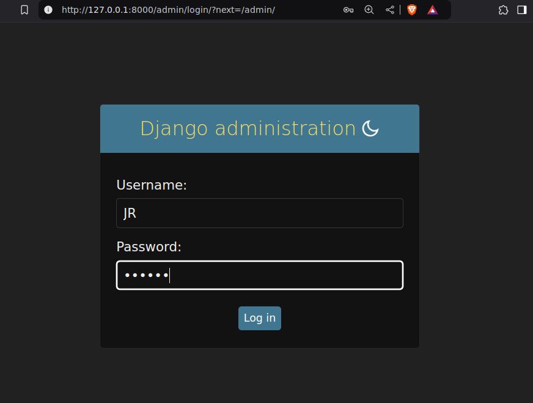

login with  the credentials you set as you createdsuperuser, if successfull you should see this: 
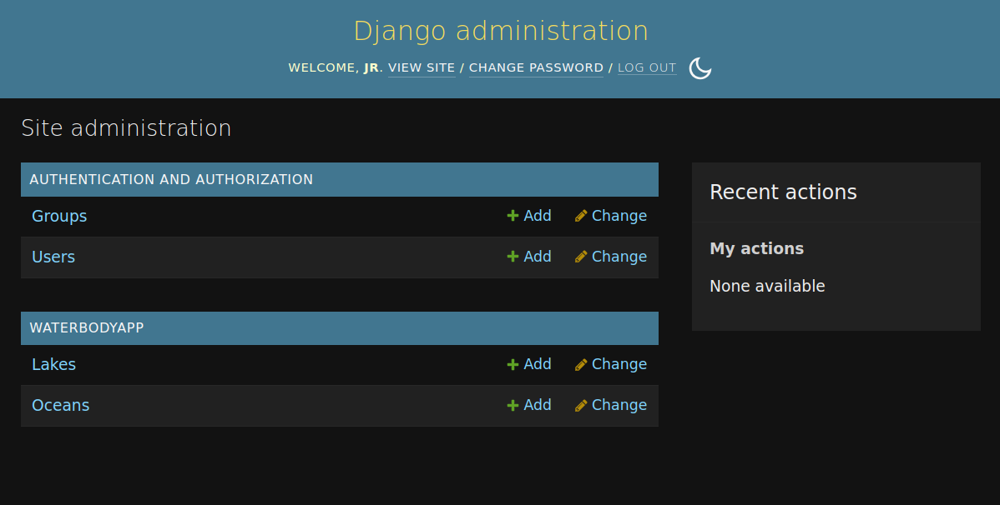

#### CRUD OPERATIONS ON Admin panel: 
- Select any model you created eg Oceans:
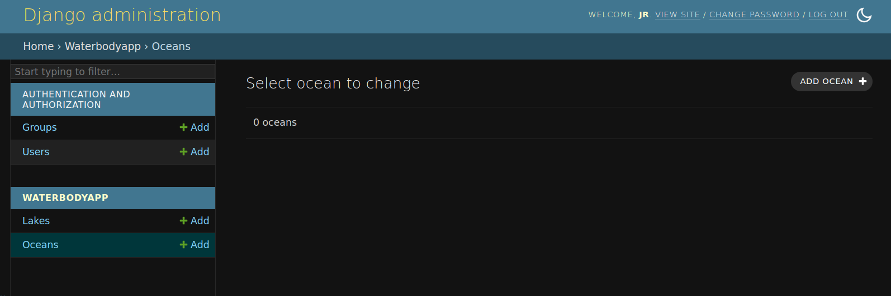

- click on the top right section on `add ocean+`
- You should see a table as such: 
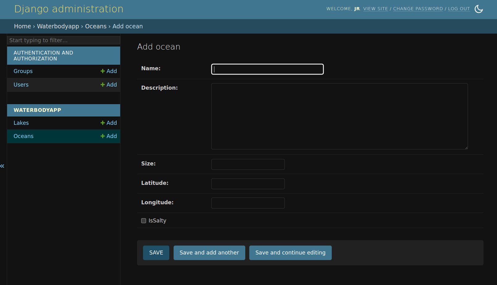

- Fill in information: 


- if successfull: 
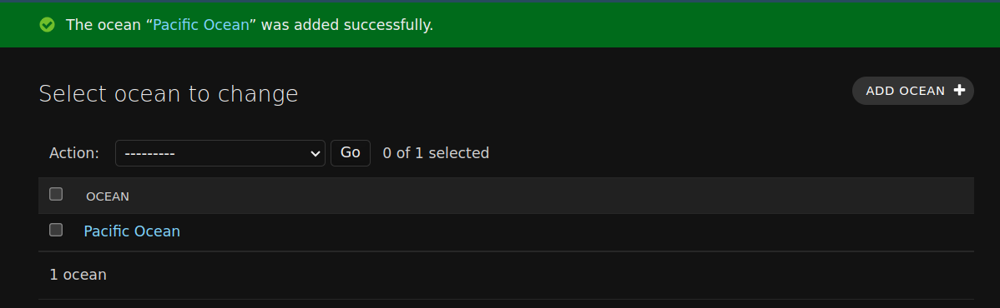

- if you click on the ocean name it will take you to the edit form and you will still be able to edit it, it will look like this:
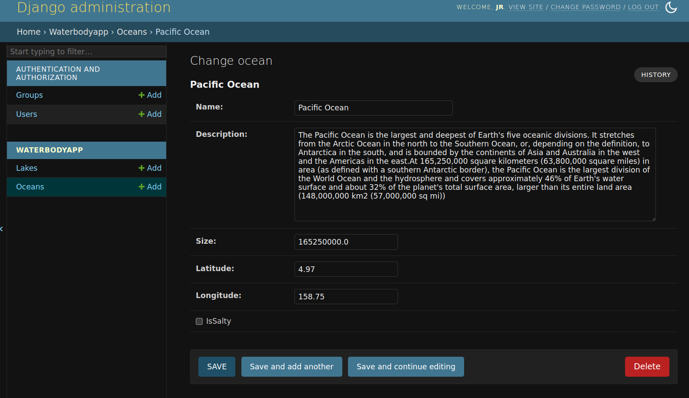


### Perform **CRUD** operations via the view...model..template


### Create the Model Form 
#### Create `form.html` and pass in he ``
#### Create the **Create** url and view function
#### Create the **Read One** url and view function
#### Create the **Read All** url and view function
#### Create the **Update** url and view function
#### Create the **Delete** url and view function

